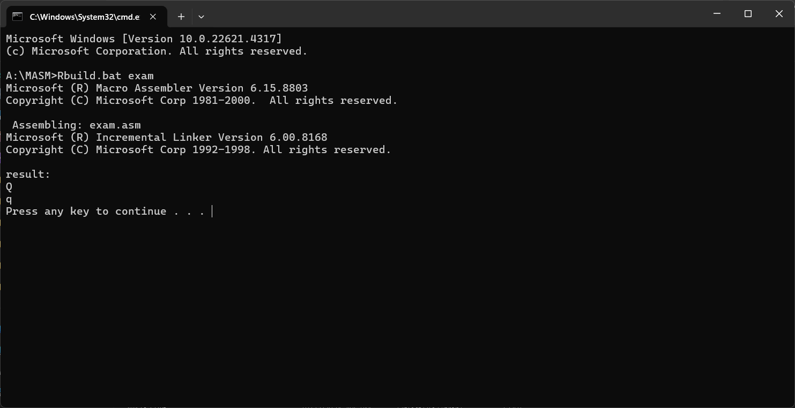
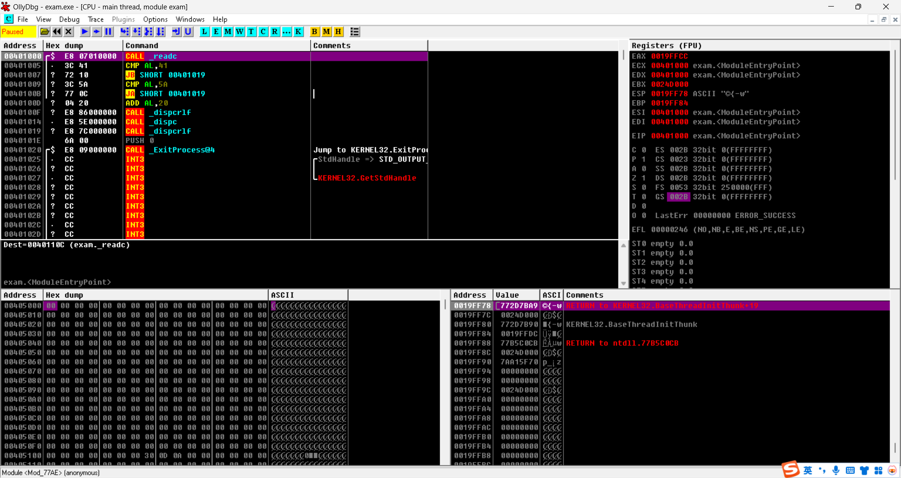

# MASM

解决MASM在x86环境下编译后的程序能在windows下快捷运行

## 配置方法

在环境变量添加改目录的路径以及bin路径

如：

A:\MASM\MASM

A:\MASM\MASM\bin

## 使用方法

在根目录下使用(最好将要编译的文件都扔入这里面)

```sh
Rbuild.bat exam
```

注意不要加exam.asm(该程序为大小写转换)这种后缀



## 调试方法使用

OllyDBG v2.01 Final Version + Highlight theme + all latest compitable Plugins  (2013.10.01)

点开里面的.exe文件选择编译好的exam.exe做逆向


